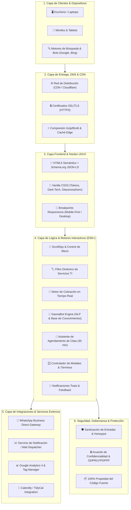
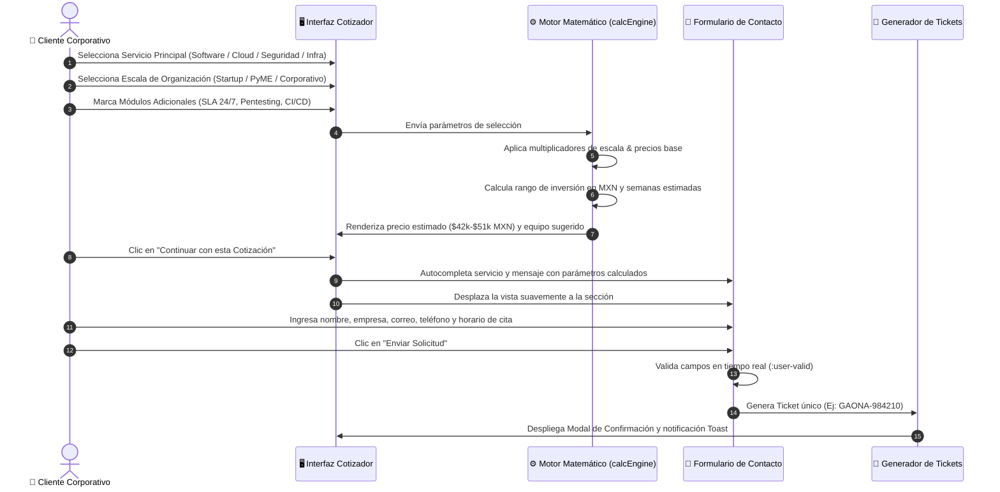
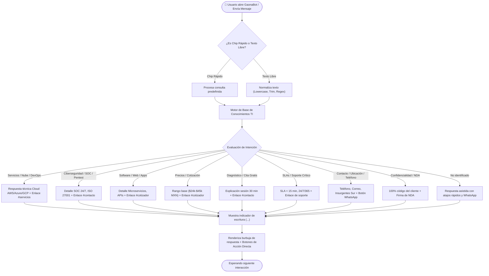

# 🏛️ Diagramas de Estructura y Arquitectura del Sistema
## Gaona Consultores TI — Plataforma Digital Corporativa

Documento técnico con los diagramas de arquitectura de software, flujo de información, componentes del sistema y modelos de interacción para la plataforma web de **Gaona Consultores TI**.

---

## 1. Diagrama de Arquitectura por Capas del Sistema (System Architecture)

Representa la interacción de extremo a extremo entre los usuarios empresariales, la capa de entrega/seguridad, el motor frontend interactivo y los servicios de integración.

---

## 2. Diagrama de Arquitectura de Información & Mapa de Sitio (Sitemap & User Journey)

Estructura de navegación modular orientada a guiar al visitante corporativo hacia la conversión (diagnóstico, cotización o contacto inmediato).

```mermaid
graph TD
    Home["🏠 Inicio (Landing Corporativa)"]

    Home --> Nav["Barra de Navegación Fija (64px)"]
    Home --> Hero["Hero: Propuesta de Valor + KPIs en Vivo + Centro de Operaciones"]
    Home --> Partners["Ecosistema Tecnológico (AWS, Azure, GCP, Cisco, Fortinet)"]
    Home --> Services["Catálogo Interactivo de Servicios TI"]
    Home --> Solutions["Casos de Éxito & Soluciones por Industria"]
    Home --> WhyUs["Nuestra Esencia: Por Qué Elegir a Gaona Consultores"]
    Home --> Estimator["Cotizador de Proyectos TI (Calculadora en Tiempo Real)"]
    Home --> Testimonials["Testimonios B2B & Prueba Social"]
    Home --> FAQ["Preguntas Frecuentes (Acordeón Interactivo)"]
    Home --> Contact["Diagnóstico TI & Agendamiento de Reunión"]
    Home --> Footer["Pie de Página & Enlaces Legales"]

    %% Detalle de Servicios
    Services --> S1["☁️ Cloud & DevOps"]
    Services --> S2["🛡️ Ciberseguridad & SOC 24/7"]
    Services --> S3["💻 Software a Medida & APIs"]
    Services --> S4["🔌 Redes & Infraestructura"]
    Services --> S5["🎯 Consultoría & Gobierno TI"]

    %% Detalle de Casos de Éxito
    Solutions --> C1["Sector Financiero / Fintech"]
    Solutions --> C2["Retail & E-Commerce"]
    Solutions --> C3["Logística & Distribución"]

    %% Acciones Flotantes
    Home -.-> FloatChat["🤖 GaonaBot (Asistente 24/7)"]
    Home -.-> FloatWA["💬 WhatsApp Flotante Directo"]
    Home -.-> FloatTop["↑ Volver al Inicio"]
```

---

## 3. Flujo de Datos del Cotizador Interactivo de Proyectos TI

Secuencia de cálculo matemático dinámico y transferencia de parámetros hacia el formulario de contacto formal.

---

## 4. Arquitectura del Motor Conversacional (GaonaBot ⚡)

Proceso de procesamiento de lenguaje natural y resolución de consultas del asistente virtual.

---

## 5. Matriz de Componentes y Responsabilidades

| Componente | Archivo Fuente | Responsabilidad Principal |
| :--- | :--- | :--- |
| **Núcleo de Estilos & Tokens** | [`css/styles.css`](../css/styles.css) | Variables de color, fuentes Google Fonts, estilos glassmorphism, responsive queries (1080px/768px). |
| **Estructura Semántica** | [`index.html`](../index.html) | Layout principal, metadatos SEO, marcado Schema.org, catálogo, formularios y modales. |
| **Controlador Interactivo** | [`js/main.js`](../js/main.js) | Lógica del cotizador, chatbot GaonaBot, filtro de servicios, agendador de citas y modales. |
| **Activos Gráficos & Branding** | [`assets/images/`](../assets/images/) | Isotipo 3D oficial, logotipo dark-mode, imágenes de casos de estudio en alta resolución. |
| **Documentación & Propuesta PDF** | [`docs/`](../docs/) | Documento imprimible y PDF formal de la propuesta técnica. |
